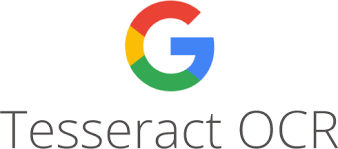
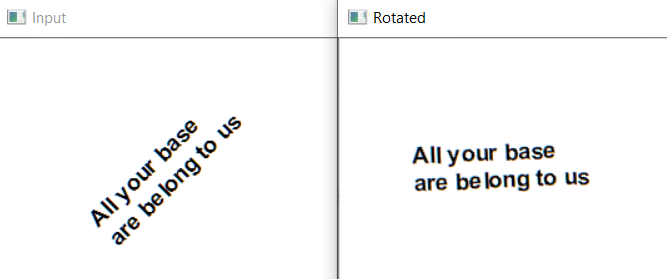
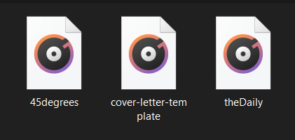
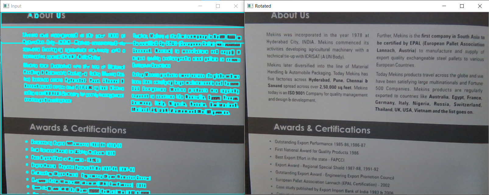

# Text_to_Speech_Automation

## Overview 
In order for OCR to be performed on a image, several steps must be performed on the source image. Segmentation is the process of identifying the regions of the image that represent characters.
This project uses several image segmentation techniques to extract text from an image and then converting it to an audio file.

## Tools
| Logo | Tool |
| --- | --- |
|  | OpenCV for image segmentation. |
|  | pytesseract for text recognition OCR. |
|  | numpy for working with arrays. |

## Features
The features that have been deployed in this project are:
| Image | Description |
| --- | --- |
|  | The program have capability to handle with tilt images. If the input image is at an inclined angle, it can be transformed to desired position for text recognition. |
|  | The detected text can be saved in a text file format. This is used for audio file to take further action with the help of this [.txt file](Text_to_Speech_Detection/Text_Recognized/cover-letter-template.txt) |
|  | The recognized text is saved and is futher used to convert into an audio file for it to read aloud. |
|  | Image can also be grabbed from video input feature and text recognition can be performed. |

## Applications
* People with low vision can hear the text read aloud.
* Saved time and money.
* Easier implementation with Internet of Things *IoT*
* It can be used as an accessibility feature to help people who have trouble reading on-screen text, but it's also convenient for those who want to be read to.

## Future Scope
* This can be implemented for blind persons to help them in reading books, newspaper, etc. 
* Integration with android application for documentation scanner and *OCR* text extraction.
